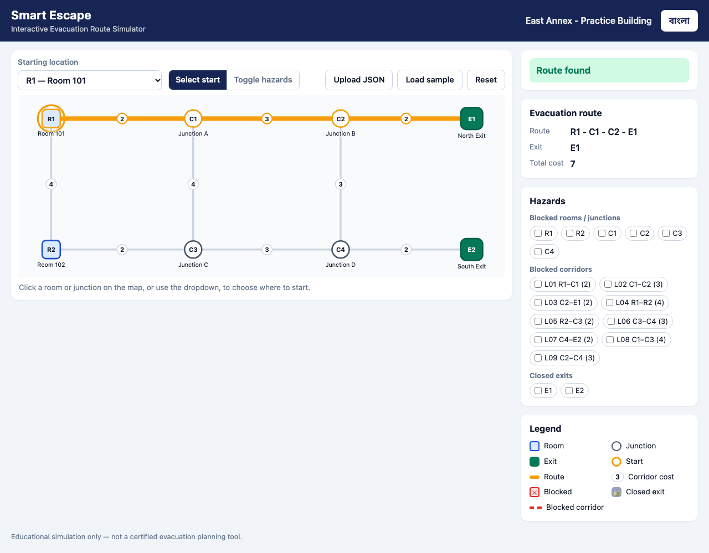
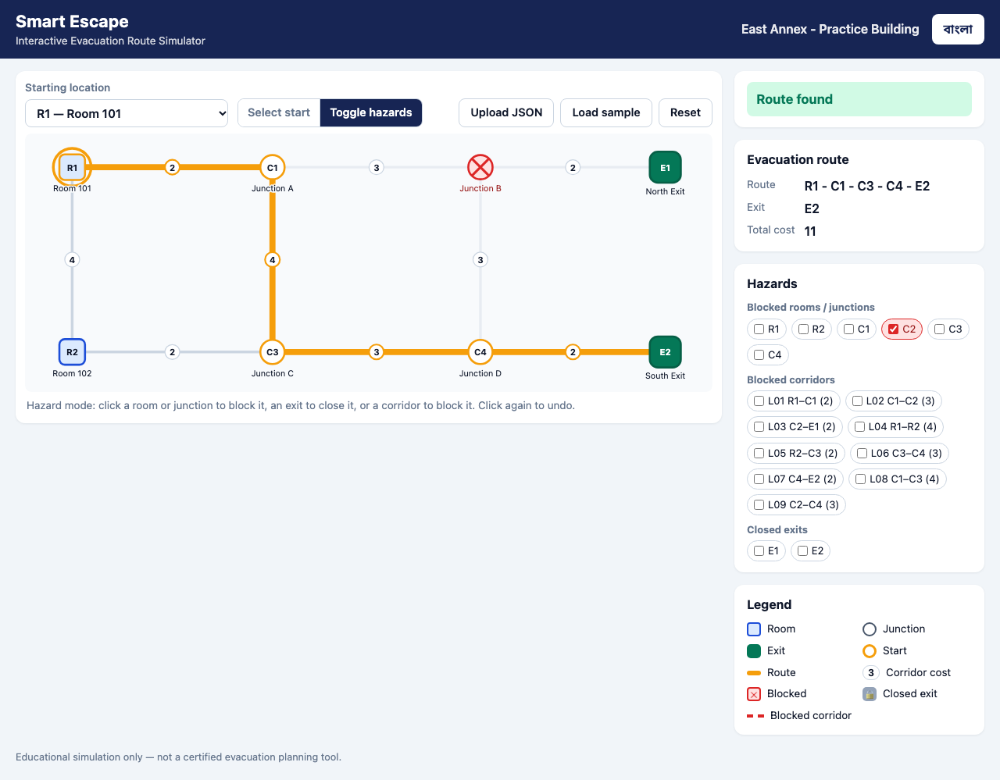

# Smart Escape

Interactive evacuation route simulator built for the AI DevFest 2026 vibe-coding mock test. It loads a building graph from JSON and draws it as a map. You pick a starting room or junction, and it shows the lowest-cost route to an open exit. When you block rooms, junctions or corridors, or close exits, it reroutes immediately. Everything is available in **English and Bangla**.

> Educational simulation only. This is not a certified real-world evacuation planning tool.

## Participant
- **Name:** Sharif Rafid Ur Rahman
- **Registration number:** Mock test, no registration number (practice repo `devfest-mocktest`)

## Live link
**https://sharifrafid.github.io/devfest-mocktest/** (GitHub Pages over HTTPS; no login or install)

## How to run
- **Live:** open the link above in the latest Chrome. The sample `building.json` loads automatically.
- **Locally:**
  1. Run `npm run serve` (or `python3 -m http.server 8000`).
  2. Open http://localhost:8000.

  Opening `index.html` directly via `file://` can't auto-load the sample, and the page shows a notice saying so. There is no build step and there are no dependencies: it is plain HTML, CSS and vanilla JS ES modules.
- **Tests:** `npm test` runs 106 `node:test` cases with no dependencies (Node 18+). They cover:
  - the router and its tie-breaks;
  - the validator;
  - geometry;
  - i18n parity.

## Main features (spec §3.2)
- **Import and map**
  - `building.json` is the default. Any same-schema file can be loaded with **Upload JSON**, by **drag-and-drop** onto the map, or reloaded with **Load sample**.
  - Every rule in §3.1 is validated, and **every error is listed with its path** (e.g. `edges[0].cost: Cost must be a positive integer`). A rejected file keeps the current map.
  - Nodes are drawn at the supplied coordinates, scaled to fit any range: negative, huge or identical coordinates all work.
  - Rooms, junctions and exits have distinct shapes. Each node shows its ID and label, and every corridor shows its cost.
- **Select and calculate**
  - Pick a room or junction as the start from the dropdown, by clicking the map, or with Enter/Space on a focused node.
  - The route is highlighted, and the panel shows the node sequence, the exit and the total cost.
- **Change conditions**
  - In **Toggle hazards** mode, clicking a node blocks a room/junction or closes an exit. Corridors toggle on click in either mode.
  - Side checkbox lists mirror the map.
  - Each state looks different:
    - blocked node: red ✕;
    - blocked corridor: red dashed line;
    - closed exit: gray with a lock;
    - corridors next to a blocked node: dimmed.
- **Update and reset**
  - The route is recalculated synchronously after every change.
  - **Reset** restores the file's original `initial_state` and keeps the chosen start.
- **Failure cases:** exact status strings **No route available** and **Starting location blocked** (and Bangla equivalents).
- **Two languages:**
  - The English/বাংলা toggle covers every label, button, status, hint, legend and error.
  - The choice is remembered in `localStorage`.
  - Dataset labels stay unchanged.
- **Animations (§4.2):**
  - The route draws in 280 ms.
  - The start ring scales in.
  - The toggled hazard pops.
  - Nothing blocks input, and `prefers-reduced-motion` turns all animations off.

## Routing rules (spec §3.3 / §3.4)
- The cost is the sum of edge costs. Coordinates and hop counts are never used.
- Blocked rooms/junctions are excluded, along with every corridor attached to them. Blocked corridors are excluded. Closed exits can't be a destination or a point along the way. Exits always end a route.
- Ties are broken in this order:
  1. minimum total cost;
  2. lexicographically smallest **exit ID**;
  3. lexicographically smallest **node-ID sequence**.

  IDs are compared by code unit (`"R10" < "R2"`, `"E1" < "e1"`), never with `localeCompare`.
- Implementation: Dijkstra that keeps the full path per node, which is correct because costs are positive. It was cross-checked against brute-force search on 5,700 random graphs.
- Order of status checks: no start, then start blocked, then no route.

## Bonus features
- Drag-and-drop upload, "Load sample", 1 MB upload limit.
- Keyboard-accessible map nodes. Focus is kept across re-renders.
- Responsive layout. On phones the map scrolls sideways inside its own box.
- Remembered language choice. Reduced-motion support.

## Known issues / assumptions
- **Duplicate IDs inside an `initial_state` array** are accepted and deduplicated, with a warning rather than a rejection.
- **Numbers as strings** (e.g. `"cost": "3"`, `"x": "10"`) are rejected, and so are numeric node IDs.
- **"Lexicographic"** means element-by-element comparison of node IDs in code-unit order; it is not a natural sort.
- **A blocked node** can't be chosen from the dropdown. If the selected start becomes blocked, it stays selected and the status shows "Starting location blocked".
- **Fonts:** Bangla uses Noto Sans Bengali from Google Fonts, with system fallbacks. Routing never depends on any external service.

## AI tools used
- **Claude Code** (Anthropic). Every prompt is logged in [`PROMPT.md`](PROMPT.md) by a `UserPromptSubmit` hook (`scripts/log-prompt.sh`). Each commit carries its prompt via `scripts/commit.sh`.

## Most useful prompt
The initial setup prompt (full text in [`PROMPT.md`](PROMPT.md), Prompt 1). It produced:
- the rulebook-driven `CLAUDE.md`;
- an edge-case analysis ([`EDGE_CASES.md`](EDGE_CASES.md)) that caught the hidden 11-cost tie in the C2 scenario;
- the phased checklist plan ([`PLAN.md`](PLAN.md));
- the automatic prompt log and the test suite.

> I'm currently participating in a vibe coding contest, read the rule book … and the … problem statement … write me a CLAUDE.md with the rules … run one agent to properly understand the problemset, figure out all the possible edgecases and any hidden test case … run another agent for creating the claude file and any other required files … for running and maintaining the necessary tests … create a PROMPT file … run the plan agent finally to create a detailed plan md file with checklists …

## Screenshots
Both were taken from the live site.

| Baseline: start R1 → R1 - C1 - C2 - E1, cost 7 | Reroute: R1 with C2 blocked → R1 - C1 - C3 - C4 - E2, cost 11 |
|---|---|
|  |  |

## Project layout
```
index.html, css/style.css
js/validate.js  js/graph.js  js/router.js  js/geometry.js  js/i18n.js   (pure logic, no DOM; tested in Node)
js/render.js  js/app.js                                                (DOM/SVG rendering and wiring)
building.json   tests/   scripts/   screenshots/
CLAUDE.md  PLAN.md  EDGE_CASES.md  PROMPT.md
```

## License
MIT. See [`LICENSE`](LICENSE).
